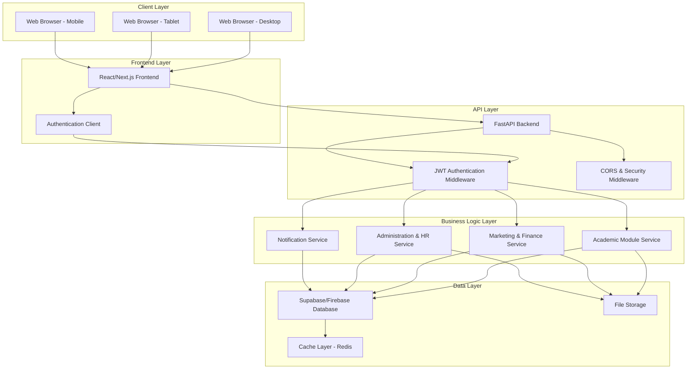

# School ERP System Design Document

## Overview

This document outlines the technical design for a School Enterprise Resource Planning (ERP) system integrating three core modules: Academic, Marketing & Finance, and Administration & Human Resources. The system is designed as a modern web application using non-relational database architecture (Supabase/Firebase) with responsive design supporting desktop, tablet, and mobile devices for 1000+ concurrent users.

## Architecture

### High-Level Architecture

The system follows a modern web application architecture with the following layers:



### Technology Stack

**Frontend:**
- **Framework**: Next.js 14 with React 18
- **Styling**: Tailwind CSS with shadcn/ui components
- **State Management**: Zustand for client state, React Query for server state
- **Authentication**: NextAuth.js with Supabase Auth
- **Charts/Analytics**: Recharts for data visualization

**Backend:**
- **API Framework**: FastAPI with Python 3.11+ for high-performance CRUD operations
- **Database**: Supabase (PostgreSQL with real-time features) or Firebase Firestore
- **Authentication**: FastAPI Security with JWT + Supabase Auth integration
- **ORM/Database Client**: SQLAlchemy with asyncpg for Supabase, or Firebase Admin SDK
- **File Storage**: Supabase Storage or Firebase Storage
- **Caching**: Redis for session management and performance optimization
- **API Documentation**: Automatic OpenAPI/Swagger documentation with FastAPI

**Infrastructure:**
- **Frontend Hosting**: Vercel for Next.js application
- **Backend Hosting**: Railway, Render, or DigitalOcean for FastAPI services
- **Database**: Supabase/Firebase for managed database services
- **CDN**: Vercel Edge Network for global content delivery
- **Monitoring**: Vercel Analytics + Sentry for error tracking + FastAPI built-in monitoring

## Components and Interfaces

### Core Components

#### 1. Authentication System (FastAPI)
```python
# FastAPI Authentication Service
from fastapi import FastAPI, Depends, HTTPException, status
from fastapi.security import HTTPBearer, HTTPAuthorizationCredentials
from pydantic import BaseModel
from typing import Optional, List
import jwt
from datetime import datetime, timedelta

class LoginCredentials(BaseModel):
    email: str
    password: str

class UserRegistration(BaseModel):
    email: str
    password: str
    role: str
    profile: dict

class User(BaseModel):
    id: str
    email: str
    role: str  # 'admin' | 'student' | 'staff'
    profile: dict
    permissions: List[str]
    last_login: Optional[datetime]

class AuthService:
    async def login(self, credentials: LoginCredentials) -> dict:
        # Authenticate user and return JWT token
        pass
    
    async def register(self, user_data: UserRegistration) -> dict:
        # Register new user
        pass
    
    async def verify_token(self, token: str) -> User:
        # Verify JWT token and return user
        pass
    
    async def refresh_token(self, refresh_token: str) -> str:
        # Generate new access token
        pass
```

#### 2. Academic Module (FastAPI)
```python
from fastapi import APIRouter, Depends, HTTPException
from pydantic import BaseModel
from typing import List, Optional
from datetime import datetime

class CourseCreate(BaseModel):
    name: str
    code: str
    description: str
    credits: int
    instructor_id: str
    schedule: List[dict]

class Course(BaseModel):
    id: str
    name: str
    code: str
    description: str
    credits: int
    instructor_id: str
    schedule: List[dict]
    enrolled_students: List[str]
    created_at: datetime
    updated_at: datetime

class GradeCreate(BaseModel):
    student_id: str
    course_id: str
    assessment_type: str
    score: float
    max_score: float
    feedback: Optional[str] = None

class AcademicService:
    async def create_course(self, course_data: CourseCreate) -> Course:
        # Create new course with optimized database operations
        pass
    
    async def get_courses(self, skip: int = 0, limit: int = 100, filters: dict = None) -> List[Course]:
        # Efficient pagination and filtering for large datasets
        pass
    
    async def update_course(self, course_id: str, updates: dict) -> Course:
        # Atomic update operations
        pass
    
    async def delete_course(self, course_id: str) -> bool:
        # Soft delete with cascade handling
        pass
    
    async def record_grade(self, grade_data: GradeCreate) -> dict:
        # Batch grade recording for performance
        pass
    
    async def get_student_performance(self, student_id: str) -> dict:
        # Aggregated performance data with caching
        pass

# FastAPI Router
academic_router = APIRouter(prefix="/api/academic", tags=["academic"])

@academic_router.post("/courses", response_model=Course)
async def create_course(course: CourseCreate, current_user: User = Depends(get_current_user)):
    return await AcademicService().create_course(course)

@academic_router.get("/courses", response_model=List[Course])
async def get_courses(skip: int = 0, limit: int = 100):
    return await AcademicService().get_courses(skip, limit)
```

#### 3. Marketing & Finance Module
```typescript
interface MarketingFinanceService {
  // Fee Management
  createFeeStructure(feeData: FeeStructureData): Promise<FeeStructure>
  generateInvoice(studentId: string, feeType: string): Promise<Invoice>
  processPayment(paymentData: PaymentData): Promise<PaymentResult>
  getPaymentHistory(studentId: string): Promise<Payment[]>
  generateReceipt(paymentId: string): Promise<Receipt>
  
  // Financial Reporting
  getFinancialSummary(dateRange: DateRange): Promise<FinancialSummary>
  generateExpenseReport(dateRange: DateRange): Promise<ExpenseReport>
  getRevenueAnalytics(period: string): Promise<RevenueAnalytics>
  
  // Marketing Campaigns
  createCampaign(campaignData: CampaignData): Promise<Campaign>
  trackCampaignMetrics(campaignId: string): Promise<CampaignMetrics>
  generateROIReport(campaignId: string): Promise<ROIReport>
  getLeadConversions(campaignId: string): Promise<ConversionData[]>
}

interface Invoice {
  id: string
  studentId: string
  amount: number
  dueDate: Date
  status: 'pending' | 'paid' | 'overdue'
  items: InvoiceItem[]
  createdAt: Date
}
```

#### 4. Administration & HR Module
```typescript
interface AdministrationHRService {
  // Employee Management
  createEmployee(employeeData: EmployeeData): Promise<Employee>
  updateEmployee(id: string, updates: Partial<EmployeeData>): Promise<Employee>
  getEmployees(filters?: EmployeeFilters): Promise<Employee[]>
  processPayroll(payrollData: PayrollData): Promise<PayrollResult>
  
  // Leave Management
  submitLeaveRequest(requestData: LeaveRequestData): Promise<LeaveRequest>
  approveLeaveRequest(requestId: string, decision: ApprovalDecision): Promise<void>
  getLeaveBalance(employeeId: string): Promise<LeaveBalance>
  
  // Asset Management
  createAsset(assetData: AssetData): Promise<Asset>
  updateAssetStatus(assetId: string, status: AssetStatus): Promise<void>
  scheduleAssetMaintenance(assetId: string, maintenanceData: MaintenanceData): Promise<void>
  getAssetReport(): Promise<AssetReport>
  
  // Performance Tracking
  recordPerformanceReview(employeeId: string, reviewData: PerformanceReviewData): Promise<void>
  getPerformanceMetrics(employeeId: string): Promise<PerformanceMetrics>
}

interface Employee {
  id: string
  personalInfo: PersonalInfo
  jobDetails: JobDetails
  salary: SalaryInfo
  leaveBalance: LeaveBalance
  performanceHistory: PerformanceReview[]
  createdAt: Date
  updatedAt: Date
}
```

### API Layer Design

#### FastAPI Endpoints with Automatic Documentation

**Authentication Endpoints:**
```python
@app.post("/api/auth/login", response_model=TokenResponse)
@app.post("/api/auth/register", response_model=UserResponse)
@app.post("/api/auth/refresh", response_model=TokenResponse)
@app.post("/api/auth/logout", status_code=204)
@app.get("/api/auth/me", response_model=User)
```

**Academic Module Endpoints:**
```python
# Courses
@app.get("/api/academic/courses", response_model=List[Course])
@app.post("/api/academic/courses", response_model=Course, status_code=201)
@app.put("/api/academic/courses/{course_id}", response_model=Course)
@app.delete("/api/academic/courses/{course_id}", status_code=204)

# Grades & Performance
@app.get("/api/academic/students/{student_id}/grades", response_model=List[Grade])
@app.post("/api/academic/grades", response_model=Grade, status_code=201)
@app.get("/api/academic/students/{student_id}/attendance", response_model=AttendanceReport)
@app.post("/api/academic/attendance", response_model=AttendanceRecord, status_code=201)

# Bulk Operations for Performance
@app.post("/api/academic/grades/bulk", response_model=List[Grade])
@app.post("/api/academic/attendance/bulk", response_model=List[AttendanceRecord])
```

**Marketing & Finance Endpoints:**
```python
# Financial Management
@app.get("/api/finance/invoices", response_model=PaginatedInvoices)
@app.post("/api/finance/invoices", response_model=Invoice, status_code=201)
@app.get("/api/finance/payments", response_model=PaginatedPayments)
@app.post("/api/finance/payments", response_model=Payment, status_code=201)
@app.get("/api/finance/reports/summary", response_model=FinancialSummary)

# Marketing Campaigns
@app.get("/api/marketing/campaigns", response_model=List[Campaign])
@app.post("/api/marketing/campaigns", response_model=Campaign, status_code=201)
@app.get("/api/marketing/campaigns/{campaign_id}/metrics", response_model=CampaignMetrics)
@app.get("/api/marketing/analytics/roi", response_model=ROIAnalytics)
```

**Administration & HR Endpoints:**
```python
# Employee Management
@app.get("/api/hr/employees", response_model=PaginatedEmployees)
@app.post("/api/hr/employees", response_model=Employee, status_code=201)
@app.put("/api/hr/employees/{employee_id}", response_model=Employee)
@app.delete("/api/hr/employees/{employee_id}", status_code=204)

# Leave Management
@app.get("/api/hr/leave-requests", response_model=List[LeaveRequest])
@app.post("/api/hr/leave-requests", response_model=LeaveRequest, status_code=201)
@app.put("/api/hr/leave-requests/{request_id}/approve", response_model=LeaveRequest)

# Asset Management
@app.get("/api/admin/assets", response_model=PaginatedAssets)
@app.post("/api/admin/assets", response_model=Asset, status_code=201)
@app.put("/api/admin/assets/{asset_id}", response_model=Asset)
```

**Performance Features:**
- Automatic request/response validation with Pydantic
- Built-in async support for database operations
- Automatic OpenAPI/Swagger documentation at `/docs`
- Request/response compression
- Background tasks for heavy operations
- Database connection pooling

## Data Models

### Database Schema Design (Supabase/Firebase)

#### Users Collection
```json
{
  "id": "uuid",
  "email": "string",
  "role": "admin | student | staff",
  "profile": {
    "firstName": "string",
    "lastName": "string",
    "phone": "string",
    "avatar": "string",
    "dateOfBirth": "date",
    "address": "object"
  },
  "permissions": ["string"],
  "isActive": "boolean",
  "lastLogin": "timestamp",
  "createdAt": "timestamp",
  "updatedAt": "timestamp"
}
```

#### Courses Collection
```json
{
  "id": "uuid",
  "name": "string",
  "code": "string",
  "description": "string",
  "credits": "number",
  "instructorId": "uuid",
  "schedule": [
    {
      "day": "string",
      "startTime": "time",
      "endTime": "time",
      "room": "string"
    }
  ],
  "enrolledStudents": ["uuid"],
  "isActive": "boolean",
  "createdAt": "timestamp",
  "updatedAt": "timestamp"
}
```

#### Grades Collection
```json
{
  "id": "uuid",
  "studentId": "uuid",
  "courseId": "uuid",
  "assessmentType": "quiz | exam | assignment | project",
  "score": "number",
  "maxScore": "number",
  "grade": "string",
  "feedback": "string",
  "recordedBy": "uuid",
  "recordedAt": "timestamp"
}
```

#### Invoices Collection
```json
{
  "id": "uuid",
  "studentId": "uuid",
  "amount": "number",
  "currency": "string",
  "dueDate": "date",
  "status": "pending | paid | overdue | cancelled",
  "items": [
    {
      "description": "string",
      "amount": "number",
      "quantity": "number"
    }
  ],
  "paymentHistory": [
    {
      "amount": "number",
      "paymentDate": "timestamp",
      "method": "string",
      "transactionId": "string"
    }
  ],
  "createdAt": "timestamp",
  "updatedAt": "timestamp"
}
```

#### Employees Collection
```json
{
  "id": "uuid",
  "employeeId": "string",
  "personalInfo": {
    "firstName": "string",
    "lastName": "string",
    "email": "string",
    "phone": "string",
    "address": "object",
    "emergencyContact": "object"
  },
  "jobDetails": {
    "position": "string",
    "department": "string",
    "hireDate": "date",
    "employmentType": "full-time | part-time | contract",
    "reportingManager": "uuid"
  },
  "salary": {
    "baseSalary": "number",
    "currency": "string",
    "payFrequency": "monthly | bi-weekly | weekly"
  },
  "leaveBalance": {
    "annual": "number",
    "sick": "number",
    "personal": "number"
  },
  "isActive": "boolean",
  "createdAt": "timestamp",
  "updatedAt": "timestamp"
}
```

## Error Handling

### Error Response Format
```typescript
interface APIError {
  success: false
  error: {
    code: string
    message: string
    details?: any
    timestamp: string
    requestId: string
  }
}

interface APISuccess<T> {
  success: true
  data: T
  meta?: {
    pagination?: PaginationInfo
    timestamp: string
    requestId: string
  }
}
```

### Error Handling Strategy
1. **Client-Side**: React Error Boundaries for component-level errors
2. **API Level**: Centralized error handling middleware
3. **Database Level**: Transaction rollback on failures
4. **User Experience**: User-friendly error messages with actionable guidance
5. **Logging**: Comprehensive error logging with Sentry integration

## Testing Strategy

### Testing Pyramid

#### Unit Tests (70%)
- Component testing with React Testing Library
- Service layer testing with Jest
- Utility function testing
- Database model validation

#### Integration Tests (20%)
- API endpoint testing
- Database integration testing
- Authentication flow testing
- Module interaction testing

#### End-to-End Tests (10%)
- Critical user journey testing with Playwright
- Cross-browser compatibility testing
- Mobile responsiveness testing
- Performance testing under load

### Test Coverage Requirements
- Minimum 80% code coverage for critical business logic
- 100% coverage for authentication and security functions
- Performance benchmarks for API response times (<2 seconds)
- Load testing for 1000+ concurrent users

## Security Considerations

### Authentication & Authorization
- JWT tokens with refresh token rotation
- Role-based access control (RBAC)
- Multi-factor authentication for admin accounts
- Session timeout and automatic logout

### Data Protection
- Encryption at rest and in transit (TLS 1.3)
- Input validation and sanitization
- SQL injection prevention (parameterized queries)
- XSS protection with Content Security Policy
- CSRF protection with tokens

### Privacy & Compliance
- GDPR compliance for data handling
- FERPA compliance for educational records
- Data anonymization for analytics
- Audit logging for sensitive operations

## Performance Optimization

### Frontend Optimization
- Code splitting and lazy loading
- Image optimization with Next.js Image component
- Caching strategies with React Query
- Bundle size optimization
- Progressive Web App (PWA) features

### Backend Optimization (FastAPI)
- **High Performance**: FastAPI's async support for concurrent request handling
- **Database Optimization**: SQLAlchemy with asyncpg for efficient PostgreSQL operations
- **Connection Pooling**: Automatic connection pooling for database efficiency
- **Redis Caching**: Cached responses for frequently accessed data
- **Background Tasks**: Async background processing for heavy operations
- **Request Validation**: Automatic request/response validation with Pydantic
- **Compression**: Built-in response compression for faster data transfer
- **Batch Operations**: Bulk CRUD operations for handling large datasets efficiently

### Monitoring & Analytics
- Real-time performance monitoring
- User behavior analytics
- Error tracking and alerting
- Database performance metrics
- API response time monitoring

This design provides a solid foundation for building a scalable, secure, and user-friendly School ERP System that meets all your requirements while leveraging modern web technologies and non-relational database architecture.